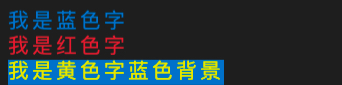

# Best Shell tool
`dev以来需要用--legacy-peer-deps来解决冲突`

---
### 1. 关于BST
BST实现的是一个shell & command的操作库，分别提供了shell控制字符串操作、shell终端操作、command parse操作和基础shell功能组件四大能力。

BST期望做到简化命令行编程能力，更快、更简单地开发命令行工具和cli。在后续的介绍过程中，会带大家实现几个命令行小功能，来了解BST开发命令行工具的过程。

---
### 2. shell控制字符模块。
该模块提供了生成控制字符的能力。所谓控制字符其实就是改变终端或文件显示的一些行为。一个控制符是由 CONTRL + key 组成的（同时按下）。控制字符同样可以通过转义以八进制或十六进制的方式显示。

#### **2.1 getFontStyle**
获取带字体样式的shell消息,我们可以通过这个能力，获取带字体颜色和背景颜色的shell消息字符串。直接用console或stdout输出这个消息，就可以看到带颜色的文字。

`getFontStyle(fontColor:Color, backColor:Color, msg:string):string`

关于Color的定义如下TS所示：
```ts
type Color = 'black' | 'red' | 'green' | 'yellow' | 'blue' | 'purple' | 'celeste' | 'white';
```

示例：
```javascript
const bst = require('best-shell-tool')

console.log(bst.getFontStyle('blue', '', '我是蓝色字'))
console.log(bst.getFontStyle('red', '', '我是红色字'))
console.log(bst.getFontStyle('yellow', 'blue', '我是黄色字蓝色背景'))
```

输出：



#### **2.2 clearAllProps**
获取清除所有属性的shell消息。通过这个可以清除前文所设置的所有属性样式。

`clearAllProps(msg:string):string`

示例：
```javascript
const bst = require('best-shell-tool')

console.log(bst.getFontStyle('blue')+'我是蓝色')
console.log(bst.getFontStyle('blue')+bst.clearAllProps('我的蓝色属性没有被继承过来'))
```

输出：


#### **2.3 getHighlightString** 
获取高亮的shell消息，其实个人感觉就是稍微加粗了一下。

`getHighlightString(msg:string):string`

示例：
```javascript
const bst = require('best-shell-tool')

console.log(bst.clearAllProps('我是普通字'))
console.log(bst.getHighlightString('我是高亮字'))
console.log(bst.getFontStyle('red') + bst.getHighlightString('我是红色高亮字'))
```

输出：


#### **2.4 getUnderLineString** 
获取下划线的shell消息

`getUnderLineString(msg:string):string`

示例：
```javascript
const bst = require('best-shell-tool')

console.log(bst.clearAllProps('我是普通字'))
console.log(bst.getUnderLineString('我是下划线字'))
console.log(bst.getFontStyle('red') + bst.getUnderLineString('我是红色下划线字'))
```

输出：


#### **2.5 getBlinkString** 
获取闪烁字体的shell消息，故名思议，该功能实现了shell文字闪烁，一般在shell交互能力中，用于表示已经选中的选项。

`getUnderLineString(msg:string):string`

示例：
```javascript
const bst = require('best-shell-tool')

console.log(bst.clearAllProps('我是普通字'))
console.log(bst.getBlinkString('我是闪烁字'))
console.log(bst.getFontStyle('red') + bst.getBlinkString('我是红色闪烁字'))
```

#### **6. getRDisplayString** 
获取反显的shell消息，所谓反显，就是模拟文字被选中的状态，一般呈现为 背景=字体颜色， 字体颜色=背景。

`getRDisplayString(msg:string):string`

示例：
```javascript
const bst = require('best-shell-tool')

console.log(bst.clearAllProps('我是普通字'))
console.log(bst.getRDisplayString('我是反显状态'))
console.log(bst.getFontStyle('red') + bst.getRDisplayString('我是红色字反显状态'))
```

输出：


#### **7. getCancelHideString** 
获取消隐的shell消息，消隐的消息在控制台是看不见的，但是占位符是真实存在的，并且文字也是可以真实复制的。

`getCancelHideString(msg:string):string`

示例：
```javascript
const bst = require('best-shell-tool')

console.log(bst.clearAllProps('我是普通字'))
console.log(bst.getCancelHideString('我是消隐状态'))
```

#### **8. controlArrowMove** 
控制shell光标移动的shell消息，通过方向指令和移动数量来控制光标的移动，可以实现在不同位置做输出的功能。

`controlArrowMove(direct:Direct, lines:number, msg:string):string`

关于Direct的定义如下TS所示：
```ts
type Direct = 'up' | 'down' | 'right' | 'left' | '上' | '下' | '左' | '右';
```

示例：
```javascript
const bst = require('best-shell-tool')

console.log('00 01 02 03')
console.log('10 11 12 13')
console.log('20 21 22 23')
console.log('30 31 32 33')
console.log(bst.controlArrowMove('上', 2, '我是移动后的'))
```

输出：


#### **9. setArrowPosition** 
设置shell光标位置的shell消息，和controlArrowMove相比，这个是直接通过指定坐标点来移动光标。

`setArrowPosition(x:number | '', y:number | '', msg:string):string`

#### **10. clearScreen** 
清屏，顾名思义，清除之前屏幕所有的内容。

`clearScreen(msg:string):string`

#### **11. saveArrowPosition** 
保存当前光标位置

`saveArrowPosition(msg:string):string`

#### **12. readArrowPosition** 
取出之前保存的光标位置

`saveArrowPosition(msg:string):string`

#### **13. hideArrow** 
隐藏光标，就是把shell的那个小黑点隐藏。

`hideArrow(msg:string):string`

#### **14. showArrow** 
显示光标

`showArrow(msg:string):string`

#### **15. clearPositionAfter** 
清除光标之后这一行的消息。在制作进度条的时候可以用它时时清除一行后的消息，保留之前输出的消息。

`clearPositionAfter(msg:string):string`

#### **16. getFmtString** 
获取格式化字符串。和前面的不同，这个是链式获取一串格式化消息，通过end结束链式调用，拿到格式化消息。其中每次返回的`StandOutOperate`操作对象，里面的所有操作链都能和前面的函数一一对应。

`function getFmtString(_msg:string):StandOutOperate`

关于StandOutOperate的定义如下TS所示：
```ts
interface StandOutOperate {
  /**
   * @description: 附加消息
   * @param {string} msg 要附加的消息
   * @return {StandOutOperate}
   */
  msg?: (msg?:string) => StandOutOperate,

  /**
   * @description: 结束并获得格式化后的字符
   * @return {string}
   */
  end?: () => string,

  /**
   * @description: 设置字体样式
   * @param {Color | ''} fontColor 字体颜色
   * @param {Color | ''} background 背景色
   * @return {StandOutOperate}
   */
  setFont?: (fontColor?: Color | '', background?: Color | '', msg?:string) => StandOutOperate,

  /**
   * @description: 清除所有控制属性
   * @param {string} msg 附加消息
   * @return {StandOutOperate}
   */
  clearProps?: (msg?:string) => StandOutOperate,

  /**
   * @description: 高亮文本
   * @param {string} msg 消息
   * @return {StandOutOperate}
   */
  highlight?: (msg?:string) => StandOutOperate,

  /**
   * @description: 下划线
   * @param {string} msg 消息
   * @return {StandOutOperate}
   */
  underline?: (msg?:string) => StandOutOperate,

  /**
   * @description: 闪烁
   * @param {string} msg 消息
   * @return {StandOutOperate}
   */
  blink?: (msg?:string) => StandOutOperate,

  /**
   * @description: 反显
   * @param {string} msg 消息
   * @return {StandOutOperate}
   */
  rdisplay?: (msg?:string) => StandOutOperate,

  /**
   * @description: 消隐
   * @param {string} msg 消息
   * @return {StandOutOperate}
   */
  cancelHide?: (msg?:string) => StandOutOperate,

  /**
   * @description: 控制光标移动
   * @param {Direct} direct 移动方向
   * @param {number} lines 移动行数
   * @param {string} msg 附加消息
   * @return {StandOutOperate}
   */
  arrowMove?: (direct?:Direct, lines?:number, msg?:string) => StandOutOperate,

  /**
   * @description: 设置鼠标位置
   * @param {number | ''} x 横坐标移动距离
   * @param {number | ''} y 纵坐标移动距离
   * @param {string} msg 附加消息
   * @return {StandOutOperate}
   */
  setArrow?: (x?:number | '', y?:number | '', msg?:string) => StandOutOperate,

  /**
   * @description: 清屏
   * @param {string} msg 附加消息
   * @return {StandOutOperate}
   */
  clear?: (msg?:string) => StandOutOperate,

  /**
   * @description: 保存光标位置
   * @param {string} msg 附加消息
   * @return {StandOutOperate}
   */
  saveArrow?: (msg?:string) => StandOutOperate,

  /**
   * @description: 读取恢复光标位置
   * @param {string} msg 附加消息
   * @return {StandOutOperate}
   */
  readArrow?: (msg?:string) => StandOutOperate,

  /**
   * @description: 隐藏光标
   * @param {string} msg 附加消息
   * @return {StandOutOperate}
   */
  hideArrow?: (msg?:string) => StandOutOperate,

  /**
   * @description: 显示光标
   * @param {string} msg 附加消息
   * @return {StandOutOperate}
   */
  showArrow?: (msg?:string) => StandOutOperate,

  /**
   * @description: 清除光标所在位置之后这一行的所有内容
   * @param {string} msg 附加消息
   * @return {StandOutOperate}
   */
  clearAfter?: (msg?:string) => StandOutOperate,
}
```

示例：
```javascript
console.log(
  bst.getFmtString('我是普通字体')
  .setFont('red', '', '我是红色字体')
  .clearProps()
  .underline('没想到我带下划线了')
  .setFont('blue', '', '我蓝了')
  .end()
)
```

输出：


